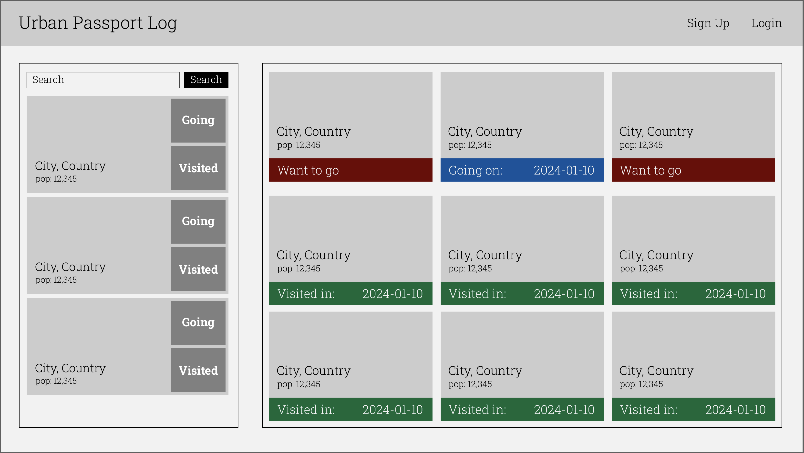
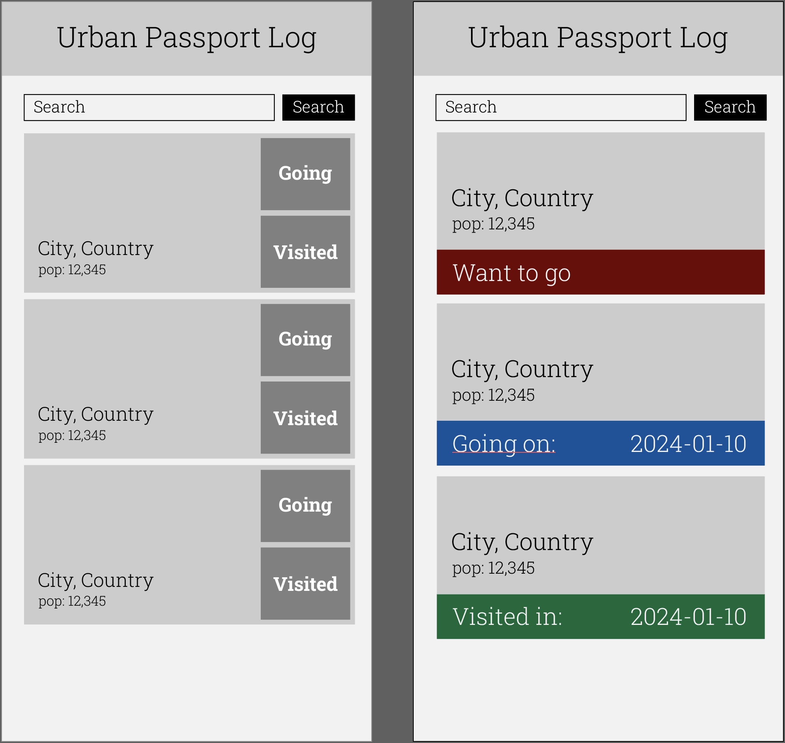

# Seal Project 2

**Name:** Hojoon Kim

**App Name:** Travel Bucket List

**Description:** Lets users search and save cities they've been to and those they'd like to go in the future. It uses the Teleport API to populate city details and images.

**GitHub URL:** https://github.com/hojoon0724/seal_project2

**Deployed Website:** https://hk-seal-project2.onrender.com

**Trello Board:** https://trello.com/invite/b/JSk1ougO/ATTI0e41e532acb089aa2498249752b4a0da5364C5A4/hk-seal-project2

## List of Dependencies (package.json)

#### Node Dependencies

- express
- bcrypt
- mongo
- ejs
- express-session
- method-override
- mongoose
- morgan

#### Front-end Dependencies

- jQuery
- Alpine

## Route Map

Table listing all routes

| Route Name | Endpoint      | Method | Description                                                                       |
| ---------- | ------------- | ------ | --------------------------------------------------------------------------------- |
| Login      | /user/login   | GET    | User login page                                                                   |
| Sign-up    | /user/signup  | GET    | User signup page                                                                  |
| Index      | /index        | GET    | Lists all cities added by the user                                                |
| Search     | /index/search | GET    | Lets user search for cities                                                       |
| New        | /index/new    | POST   | User adds it to their collection                                                  |
| Delete     | /index/delete | DELETE | User deletes from their collection                                                |
| Update     | /index/update | PUT    | User can update their status or date                                              |
| Create     | /index/create | POST   | User creates an entry to their collection                                         |
| Show       | /index/show   | GET    | Site shows the city's details such as when the user visited, the population, etc. |

## Design Mockups (Desktop + Mobile)

#### Desktop Design

#### Mobile Design

## ERD (Entity Relationship Diagram)

| USER     |     | CITY        |
| -------- | --- | ----------- |
| \_id     |     | \_id        |
|          |     | city        |
|          |     | country     |
|          |     | population  |
|          |     | status      |
|          |     | coordinates |
|          |     | desktop_img |
|          |     | mobile_img  |
| user     | --> | creator     |
| password |     |             |
